<script type="module">
  import mermaid from 'https://cdn.jsdelivr.net/npm/mermaid@10/dist/mermaid.esm.min.mjs';
    mermaid.initialize({ 
        startOnLoad: true,
        theme: 'base',
    });
</script>

<!--
# Style lead only for this slide
_class: lead
_footer: Algorithmique Avancée et Bibliothèque Graphique - 2022-2023
-->


**ING1** Projet d'informatique


# ECE World

Equipe X

---

# Equipe X


- Tata Jaja
- Toto Jojo
- Tyty Jyjy
- Tutu Juju
- Titi Jiji

---

# ECE World

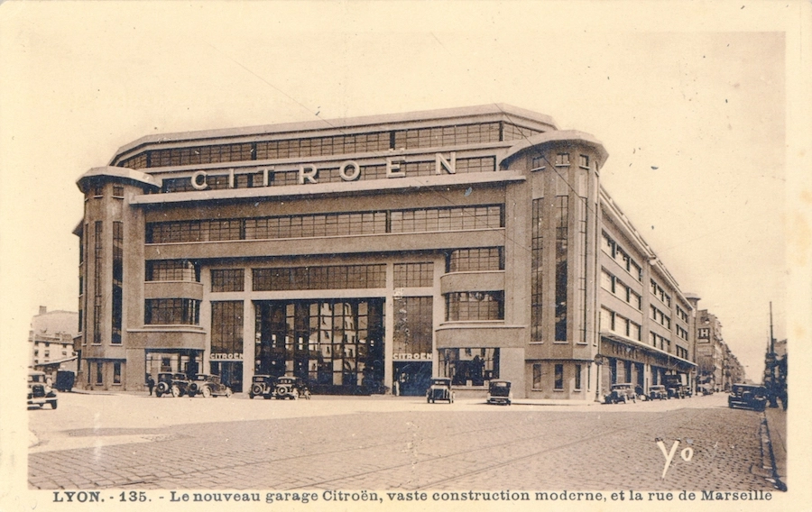

## Thème

Lorem ipsum dolor sit amet, **consectetur** adipiscing elit, sed do eiusmod tempor incididunt ut labore et dolore magna aliqua.

---

# Carte `1/2`

*Réalisée par : **Toto**, **Tata**.*

Décrire ici les fonctionnalités implémentées : choix joueurs, saisie des noms, affichage des scores/classement... Comment avez-vous fait ? Quels étaient les problèmes rencontrés.

---

# Carte `2/2`

Suite si ça ne tient pas sur une slide.

:bulb: *Vous pouvez faire comme ça à chaque fois qu'une slide ne suffit pas, il vaut mieux 5 slides légères qu'une surchargée.*

---

# Organisation des jeux

Précisez comment les jeux sont organisés ? Sont-ils dans des fichiers séparés ? Dans des dossiers ? Sont-ils éparpillés dans plusieurs fichiers ?

Quels paramètres prennent les jeux ?  La file d'événement par exemple ? Ou est-ce que chaque jeu crée sa propre file ?

Comment on lance un jeu et comment on revient à la carte à la fin de la partie ?
Comment le classement est-il mis à jour ?


---

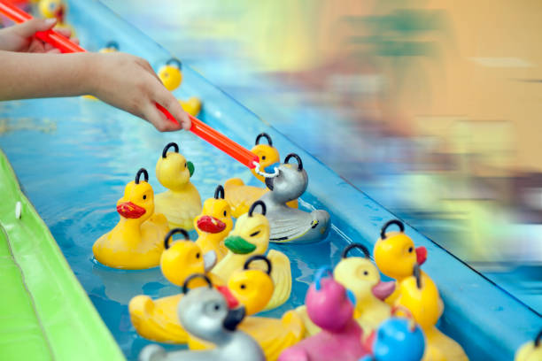

# Pêche aux canards

*Réalisé par : **Toto** (40%), **Tata** (60%).*

Décrire le fonctionnement du jeu dans les grandes lignes. Comment vous l'avez conçu.
- Les canards vont de la droite à la gauche.
- Lorsqu'ils ont disparu, ils ont 1 chance sur 50 de réapparaitre à droite.
- Les canards vont à une vitesse différente (tirée aléatoirement).
- La collision des canards est détectée.
- etc.

<sup>:bulb: Remplacez les images par des captures d'écran de votre jeu.</sup>

---


# Pêche aux canards

Pour chaque jeu (bien détailler au moins un jeu par personne), précisez les structures de données (structures importantes, tableaux importants, listes chainées...) et les fonctions importantes (avec leur prototype).

### Structures

<div class="mermaid">
%%{init: {'theme':'neutral'}}%%
classDiagram
    class Canard
    Canard : int x, y
    Canard : int vitesse
    class Canne
    Canne : int x, y
    Canne : Canard* canard
</div>

### Tableaux

- `Canard canards[20]`

---


# Pêche aux canards

### Graphe d'appel

<br>

<div class="mermaid">
%%{init: {'theme':'neutral'}}%%
flowchart LR
    pecheAuxCanards --> initialiserCanards
    initialiserCanards --> positionnerCanard
    pecheAuxCanards --> deplacerCanards
    deplacerCanards --> deplacerCanard
    pecheAuxCanards --> detecterCollisionCanards
</div>


---


# Pêche aux canards

### Logigramme

Que vous jugez pertinent (image ou Mermaid.js)


---

# Bilan collectif

---

<!--
_class: lead
-->

# Les slides suivantes ne seront pas présentées oralement lors de la soutenance mais doivent figurer dans la présentation. Nous les survolerons rapidement.

---

# Toto

## Tâches réalisées (pour chaque membre de l'équipe)

- `✅ 100%` Tâche 1
- `✅ 80%` Tâche 2
  - *Développer ici pourquoi cette tâche n'est pas terminée à 100%. (exemple : on aurait pu améliorer...).*
- `❌ 20%` Tâche 3
  - *Développer ici pourquoi cette tâche n'a pas été terminée.*
- `❌ 20%` Tâche 4
  - *Développer ici pourquoi cette tâche n'a pas été terminée.*
  - *Développer ici pourquoi cette tâche n'a pas été terminée.*

---

# Investissement

Si vous deviez vous répartir des points, comment feriez-vous ?

<div class="mermaid">
%%{init: {'theme':'neutral'}}%%
pie showData
    "Toto Jojo" : 20
    "Tata Jaja" : 20
    "Tyty Jyjy" : 10
    "Tutu Juju" : 40
    "Titi Jiji" : 10
</div>

---

# Récapitulatif des jeux

| Jeu | Avancement | Problèmes / reste |
| --- | --- | --- |
| Pêche aux canards | 100% | - |
| Tir aux ballons | 100% | - |
| Guitar Hero | 60% | Ne se synchronise pas avec la musique. Bug lors de l'appui sur deux touches en même temps (ne traite que la première note). |

Vous pouvez faire ce tableau sur plusieurs slides en dupliquant l'en-tête.

---

<!--
_class: lead
-->
# Quelques éléments que vous pouvez utiliser à votre guise dans votre présentation

---

# Schémas et Graphes

Vous pouvez utiliser [Mermaid.js](https://mermaid.js.org/) pour générer des schémas. Regardez la documentation.

---

# Slide avec du code


```C
for(int i = 0; i < 5; i++) {
    printf("%d ", i);
}
```

> 0 1 2 3 4


---

# Emojis

https://gist.github.com/rxaviers/7360908

---

# Thème

Vous pouvez personnaliser l'affichage de votre présentation avec le langage CSS en modifiant le fichier `theme.css`.

---

# Export PDF

Depuis récemment, l'export (**`Export Slide Deck...`**) en PDF oublie parfois des éléments.
Si c'est le cas, nous vous conseillons d'exporter en fichier PowerPoint (pptx), puis de l'exporter en PDF depuis PowerPoint.

---

# Antoine

- `✅ 100%` __Jeux obligatoire :__  Tir Au Ballon style
  Star Wars   🚀


- `✅ 99%` __Map :__
  - *Les colisions rendent la map un peu moins fluides.* 🌲


- `✅ 100%` __Jeux Bonus :__ Head Ball style Star Wars ⚽


---

# Tir Au Ballon  🎈🔫  `1/9`

### Les différentes textures :

- __Les Ballons__ :
  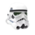   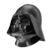    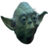

- __L'arme__ :

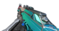

- __Les Gadgets__ :

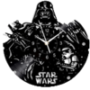  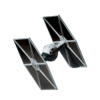  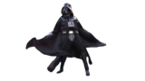

---

# Tir Au Ballon  🎈🔫  `2/9`

# Les fonctionnalitées ➕ :

➖ Mode de jeu Difficile : 91 ballons dans 3 zones 🚫

➖ Le jeu donne l'impression d'avoir de la 3D 🎲

➖ Colisions avec les bordures (diagonales), réaction des ballons aléatoires ⚡

➖ Apparitions et vitesse des ballons aléatoires 📡

➖ Son de tir et animations explosions ballons 💣

➖ Timer de 30 secondes par personnes. Les joueurs jouent l'un après l'autre 🕙

➖ Récap des scores et attributions des tickets 🎫

➖ Sauvegarde des meilleurs scores 💯

➖ Petite danse de Dark Vador 💃

---


# Tir Au Ballon  🎈🔫  `3/9`

## Capture d'écran de TirAuJedai :

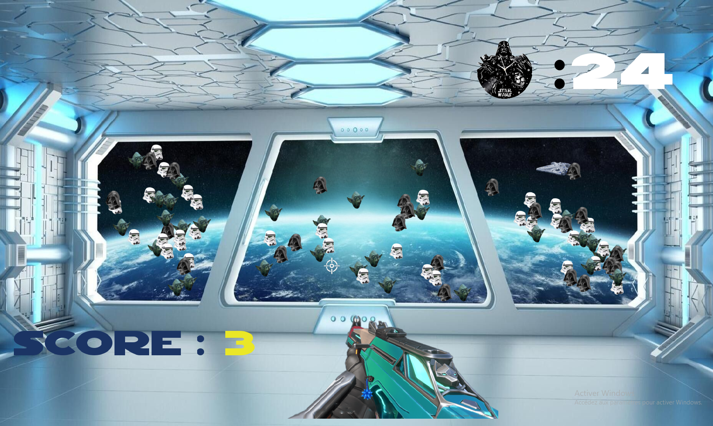

---

# Tir Au Ballon  🎈🔫  `4/9`

## Structuration :


| Donnée                  | Structure                               | Code                                                                                                                |
|-------------------------|-----------------------------------------|---------------------------------------------------------------------------------------------------------------------|
| Images                  | Tableau d'ALLEGRO_BITMAP*               | ``` ALLEGRO_BITMAP* image[50] ```    📷                                                                             |
| Appel images animations | Sprintf + for                           | ``` for (int i=0;i<50;i++){ sprintf(char,"%d.png",i); al_load_bitmap(char); } ```   🎥                              |

---

# Tir Au Ballon 🎈🔫  `5/9`

| Donnée                  | Structure                               | Code                                                                                                                |
|-------------------------|-----------------------------------------|---------------------------------------------------------------------------------------------------------------------|
| Ballons                 | Tableau de structure (x,y,numéro,vx,vy) | ``` typedef struct _BALLON { float x; float y; int num; float vx; float vy; }Ballon ``` 📌 ``` Ballon* pballon; ``` |
| Sons                    | Tableau de sample + 1 Sample Instance   | ``` ALLEGRO_SAMPLE* sons[1];  ALLEGRO_SAMPLE_INSTANCE* soninstance; ```  🔈                                         |
| Polices                 | Tableau d'ALLEGRO_FONT*                 | ``` ALLEGRO_FONT* police[3]; ```   📃                                                                               |                        |                                         |                                                                                                                     |

---

# Tir Au Ballon  🎈🔫  `6/9`

## Fonctions importantes :

| Fonction                  | Utilité                                                                                  |
|---------------------------|------------------------------------------------------------------------------------------|
| ```TAB_Create()```        | Initialisation de toutes les variables 🎓                                                  |
| ```Menu()```              | Première page du jeu. Permet au joueurs de lancer la partie quand il le souhaitent 🔍    |
| ```Assign_pos_Ballon()``` | Affichage et déplacement de tous les ballons durant la partie   🎈                         |

---

# Tir Au Ballon 🎈🔫  `7/9`

| Fonction                  | Utilité                                                                                  |
|---------------------------|------------------------------------------------------------------------------------------|
| ```Pointdroite()```       | Fonction répertoriant tous les points d'une droite affine à l'aide de deux points 📊       |    
| ```reset()```             | Fonction re-initialisant les variables quand J1 a finit 🔧                               |
| ```Menufin()```           | Fonction s'occupant de la page de fin. Les joueurs peuvent fermer et regarder les scores 🎯|                                                         |                                                                                                                     |
| ```calcultickets()```     | Fonction attribuant les tickets au joueurs 🎫                                              |
| ```sauvegarde()```        | Fonction sauvegardant les meilleurs scores. Les joueurs peuvent les consulter 📁           |

---

# Tir Au Ballon 🎈🔫  `8/9`

| Fonction                  | Utilité                                                                                  |
|---------------------------|------------------------------------------------------------------------------------------|
| ```destroy()```           | Fonction détruisant les images, fonts... et passe le programme sur la map 💥               |


__Colisions :__

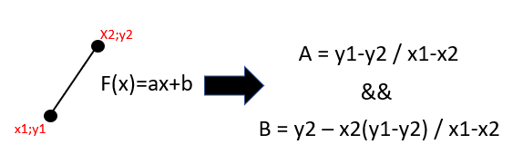
 
---

# Tir Au Ballon  🎈🔫  `9/9`

## Graphe ordres des fonctions :

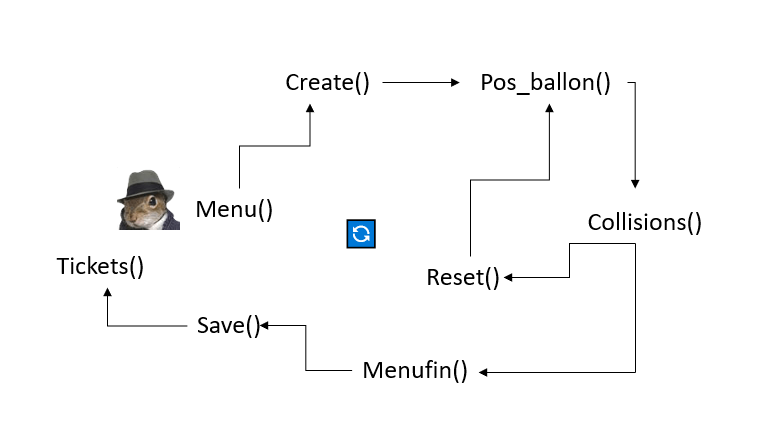

---

# Map 🌍🚪 `1/12`

## Les différentes textures :

- __Le bonhomme__ :

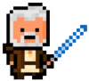

- __Mini-Map__ :

   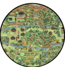

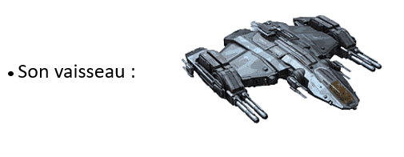

---

# Map 🌍🚪 `2/12`

# Les fonctionnalitées ➕ :

➖ Le joueur peut se déplacer librement dans la map (12 images de 1920x1080) 🏰

➖ Le joueur a un menu pour choisir son jeu suivant et peut changer son choix 🚥

➖ Le joueur peut se déplacer à pied (colisions) ou en vaisseau (pas de colisions) ✈️

➖ Le joueur peut faire Tab et voir les tickets des 2 joueurs 🎫

➖ Le joueur a une mini-map avec google maps vers son prochain jeu 📍

➖ Les colisions sont faites dans toutes la map, le joueur n'est pas limité aux chemins 🚧

  
---

# Map 🌍🚪 `3/12`

# Les fonctionnalitées ➕ :

➖ Quand il rentre dans sa maison le jeu se lance avec une animation (Robin) 🎥

➖ 7 jeux différents <=> 7 chemins différents, 7 maisons de jeu 🎓

➖ Affichage du nom de la zone quand on y rentre 🎏

➖ Le curseur s'affiche seulement si la souris bouge 🐭


---
# Map 🌍🚪 `4/12`

## Capture d'écran de la Map :

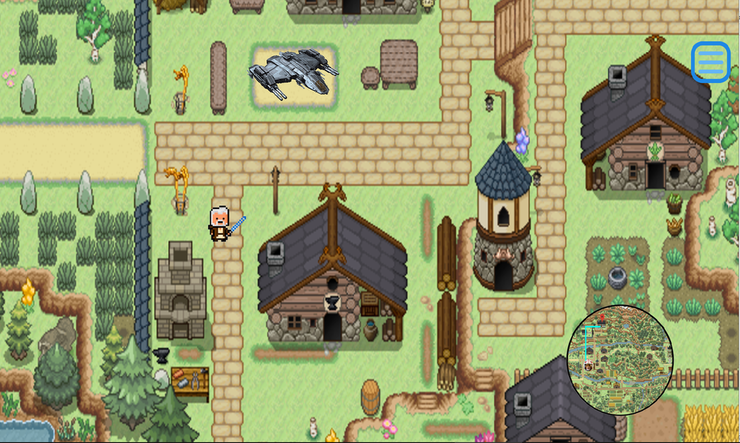

---

# Map 🌍🚪 `5/12`

# Structuration :


| Donnée                  | Structure                 | Code                                                                                                                |
|-------------------------|---------------------------|---------------------------------------------------------------------------------------------------------------------|
| Images                  | Tableau d'ALLEGRO_BITMAP* | ``` ALLEGRO_BITMAP* image[50] ```    📷                                                                             |
| Appel images animations | Sprintf + for             | ``` for (int i=0;i<50;i++){ sprintf(char,"%d.png",i); al_load_bitmap(char); } ```   🎥                              |


---

# Map 🌍🚪 `6/12`

| Donnée                | Structure                                          | Code                                                               |
|-----------------------|----------------------------------------------------|--------------------------------------------------------------------|
| Polices               | Tableau d'ALLEGRO_FONT*                            | ``` ALLEGRO_FONT* police[3]; ```   📃                              |
| Coordonnées images    | Tableau de structure                               | ``` typedef struct _IMAGES{ float x; float y}  Images* pimages;``` |
| Colisions             | Sous couche avec la map avec des rectangles rouges | ``` if (al_get_pixel(...).r >= 9.2) { Colision }```                |
| Jeux suivant          | Enum (entier)                                      | ``` enum { GAME_PAC, GAME_TAB, GAME_SNAKE  }```                    |
| Coordonnées  | Floats                                             | ``` float xbonhomme; float ybonhomme; ```                          |

---

# Map 🌍🚪 `7/12`

# Fonctions importantes :


| Fonction             | Utilité                                                                     |
|----------------------|-----------------------------------------------------------------------------|
| ```Map_Create()```   | Initialisation de toutes les variables 🎓                                   |
| ```Choixdujeu()```   | Les joueurs choisissent le jeu suivant, et peuvent changer à tout moment 🔍 |
| ```AffichageMap()``` | Affichage de la map, en fonction des déplacements du joueurs 🌏               |

---

# Map 🌍🚪 `8/12`


| Fonction               | Utilité                                                                                                                                         |
|------------------------|-------------------------------------------------------------------------------------------------------------------------------------------------|
| ```Gestionbordure()``` | S'occupe des bordures de la map : si pas de bordures le joueurs est fixe et la map bouge si bordure le joueur bouge et la map est fixe 🔒       |
| ```Minimap()```        | Prend en compte le jeu suivant et fais google maps sur la minimap 🚩                                                                            |
| ```Colisions()```      | Le calque de la map avec rectangle se déplace de la même manière que la vrai map, la fonction compare le pixel de notre joueur avec le calque ❌ |

---

# Map 🌍🚪 `9/12`

| Fonction               | Utilité                                                                                                                                         |
|------------------------|-------------------------------------------------------------------------------------------------------------------------------------------------|
| ```Bonhomme()```       | Affiche et s'occupe des déplacement du joueur 🏃                                                                                                |
| ```Affichageville()``` | Affiche le nom d'une zone quand on y rentre 💬                                                                                                    |
| ```Map_Destroy()```    | Déstruction de toutes les images,fonts ... et lance le jeu suivant et l'animation ⏩                                                             |

---

# Map 🌍🚪 `10/12`

## Exemple MAP/MAPColision :

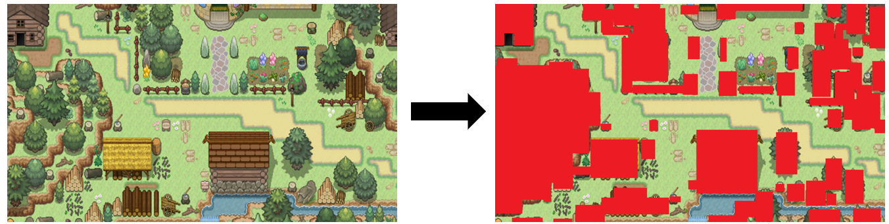

---

# Map 🌍🚪 `11/12`

## Capture d'écran choix des jeux : 

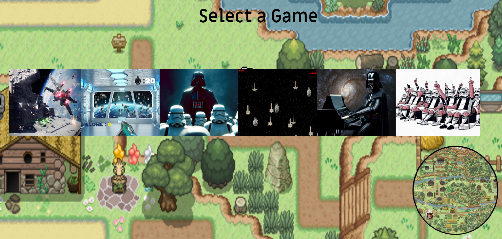

---

# Map 🌍🚪 `12/12`

# Graphe ordre des fonctions :

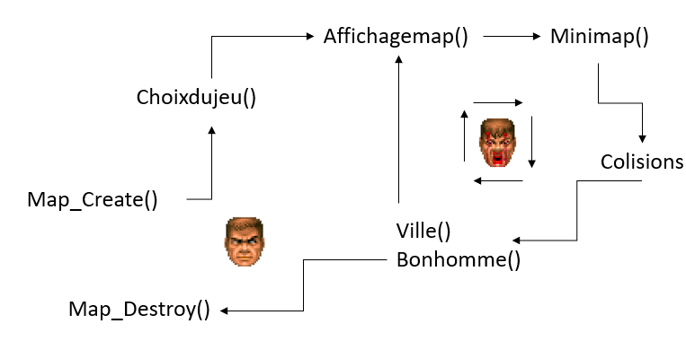

---

# Jeu Bonus : Head Jedai ⚽🎮 `1/4`

## Les différentes textures :

- __Les bonhommes__ :

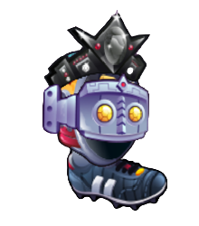  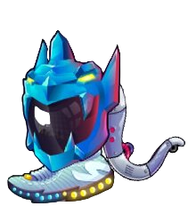

- __La Balle__ :

    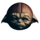

---

# Jeu Bonus : Head Jedai ⚽🎮 `2/4`

- __Les supporters__ :

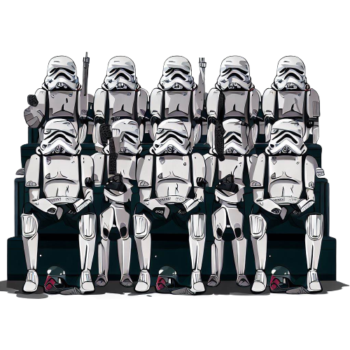  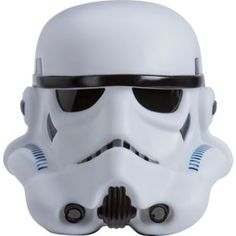

---

# Jeu Bonus : Head Jedai ⚽🎮 `3/4`

## Capture d'écran du jeu Head Jedai :

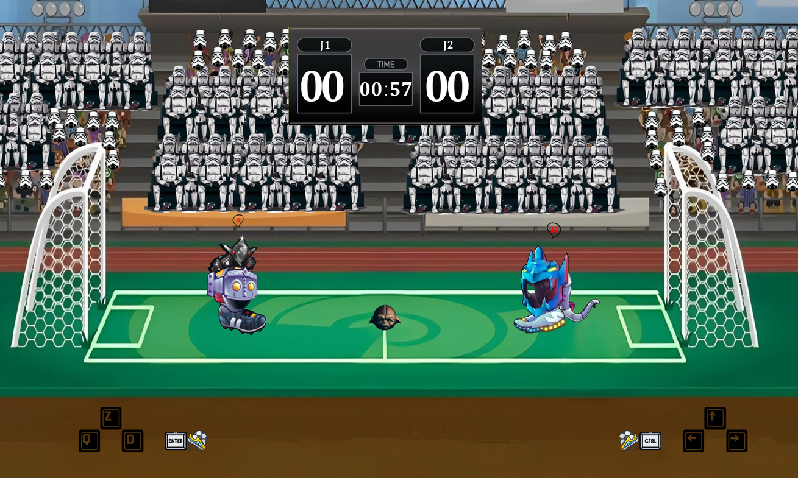

---

# Jeu Bonus : Head Jedai ⚽🎮 `4/4`

# Les fonctionnalitées ➕ :

  ➖ Les joueurs peuvent avancer, reculer, sauter et donner un coup de pied 🏃

  ➖ La balle réagit comme une vraie balle (gravité et frottement/frictions) ⚽

  ➖ Le joueur avec le plus de but en 1 minutes gagne la partie 🕜

  ➖ Colisions entre joueurs et avec la balle 🚫

  ➖ Les joueurs peuvent se donner des coups de pied et repousser l'adversaire (+ animation) 🔪

  ➖ Animation de but quand un joueur marque 🎉

  ➖ Récap des scores à la fin de partie et attribution tickets 💯

  ➖ Menu de début et menu de fin de jeu 🏁
