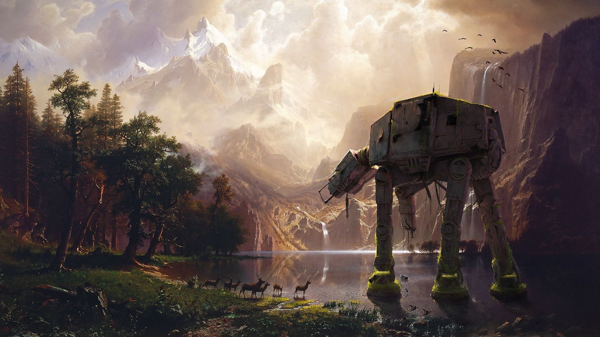

# ECE World

Une carte, des jeux. Bienvenue dans ECE World.

---

# Notre Equipe

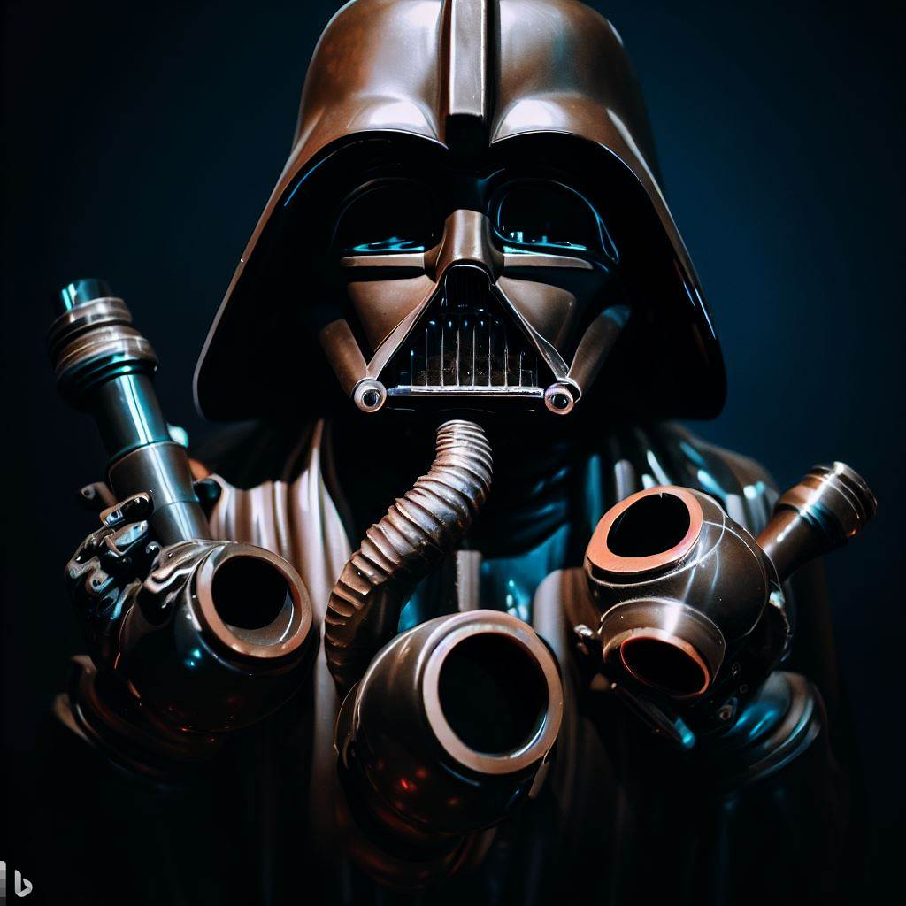

- Robin KOENIG
- Thibault GAREL
- Antoine GOUDEDRANCHE
- Matthieu GROS


---

# ECE World


## Notre thème

Au début de notre réflexion, nous voulions des jeux dans un style futuriste. C'est ainsi que nous nous sommes dirigés vers l'univers de star wars et ses limites infinies.

---

# L'inventaire de nos jeux

- Tir au ballon :balloon:
- Piano Tiles :musical_keyboard:
- Flappy Bird :bird:
- Geometry Dash :white_square_button:
- Head Jedi :soccer:
- Pêche Aux Canards
- Snake :snake:
- Traversée de la rivière :fish:

---

# Antoine

- `✅ 100%` __Jeux obligatoire :__  Tir Au Ballon style
  Star Wars   🚀


- `✅ 99%` __Map :__
  - *Les colisions rendent la map un peu moins fluides.* 🌲


- `✅ 100%` __Jeux Bonus :__ Head Ball style Star Wars ⚽

---

# Tir Au Ballon  🎈🔫  `1/9`

### Les différentes textures :

- __Les Ballons__ :
         

- __L'arme__ :


- __Les Gadgets__ :

    

---

# Tir Au Ballon  🎈🔫  `2/9`

# Les fonctionnalitées ➕ :

➖ Mode de jeu Difficile : 91 ballons dans 3 zones 🚫

➖ Le jeu donne l'impression d'avoir de la 3D 🎲

➖ Colisions avec les bordures (diagonales), réaction des ballons aléatoires ⚡

➖ Apparitions et vitesse des ballons aléatoires 📡

➖ Son de tir et animations explosions ballons 💣

➖ Timer de 30 secondes par personnes. Les joueurs jouent l'un après l'autre 🕙

➖ Récap des scores et attributions des tickets 🎫

➖ Sauvegarde des meilleurs scores 💯

➖ Petite danse de Dark Vador 💃

---


# Tir Au Ballon  🎈🔫  `3/9`

## Capture d'écran de TirAuJedi :


---

# Tir Au Ballon  🎈🔫  `4/9`

## Structuration :


| Donnée                  | Structure                               | Code                                                                                                                |
|-------------------------|-----------------------------------------|---------------------------------------------------------------------------------------------------------------------|
| Images                  | Tableau d'ALLEGRO_BITMAP*               | ``` ALLEGRO_BITMAP* image[50] ```    📷                                                                             |
| Appel images animations | Sprintf + for                           | ``` for (int i=0;i<50;i++){ sprintf(char,"%d.png",i); al_load_bitmap(char); } ```   🎥                              |

---

# Tir Au Ballon 🎈🔫  `5/9`

| Donnée                  | Structure                               | Code                                                                                                                |
|-------------------------|-----------------------------------------|---------------------------------------------------------------------------------------------------------------------|
| Ballons                 | Tableau de structure (x,y,numéro,vx,vy) | ``` typedef struct _BALLON { float x; float y; int num; float vx; float vy; }Ballon ``` 📌 ``` Ballon* pballon; ``` |
| Sons                    | Tableau de sample + 1 Sample Instance   | ``` ALLEGRO_SAMPLE* sons[1];  ALLEGRO_SAMPLE_INSTANCE* soninstance; ```  🔈                                         |
| Polices                 | Tableau d'ALLEGRO_FONT*                 | ``` ALLEGRO_FONT* police[3]; ```   📃                                                                               |                        |                                         |                                                                                                                     |

---

# Tir Au Ballon  🎈🔫  `6/9`

## Fonctions importantes :

| Fonction                  | Utilité                                                                                  |
|---------------------------|------------------------------------------------------------------------------------------|
| ```TAB_Create()```        | Initialisation de toutes les variables 🎓                                                  |
| ```Menu()```              | Première page du jeu. Permet au joueurs de lancer la partie quand il le souhaitent 🔍    |
| ```Assign_pos_Ballon()``` | Affichage et déplacement de tous les ballons durant la partie   🎈                         |

---

# Tir Au Ballon 🎈🔫  `7/9`

| Fonction                  | Utilité                                                                                  |
|---------------------------|------------------------------------------------------------------------------------------|
| ```Pointdroite()```       | Fonction répertoriant tous les points d'une droite affine à l'aide de deux points 📊       |    
| ```reset()```             | Fonction re-initialisant les variables quand J1 a finit 🔧                               |
| ```Menufin()```           | Fonction s'occupant de la page de fin. Les joueurs peuvent fermer et regarder les scores 🎯|                                                         |                                                                                                                     |
| ```calcultickets()```     | Fonction attribuant les tickets au joueurs 🎫                                              |
| ```sauvegarde()```        | Fonction sauvegardant les meilleurs scores. Les joueurs peuvent les consulter 📁           |

---

# Tir Au Ballon 🎈🔫  `8/9`

| Fonction                  | Utilité                                                                                  |
|---------------------------|------------------------------------------------------------------------------------------|
| ```destroy()```           | Fonction détruisant les images, fonts... et passe le programme sur la map 💥               |


__Colisions :__


 
---

# Tir Au Ballon  🎈🔫  `9/9`

## Graphe ordres des fonctions :


---

# Map 🌍🚪 `1/12`

## Les différentes textures :

- __Le bonhomme__ :


- __Mini-Map__ :

   


---

# Map 🌍🚪 `2/12`

# Les fonctionnalitées ➕ :

➖ Le joueur peut se déplacer librement dans la map (12 images de 1920x1080) 🏰

➖ Le joueur a un menu pour choisir son jeu suivant et peut changer son choix 🚥

➖ Le joueur peut se déplacer à pied (colisions) ou en vaisseau (pas de colisions) ✈️

➖ Le joueur peut faire Tab et voir les tickets des 2 joueurs 🎫

➖ Le joueur a une mini-map avec google maps vers son prochain jeu 📍

➖ Les colisions sont faites dans toutes la map, le joueur n'est pas limité aux chemins 🚧

  
---

# Map 🌍🚪 `3/12`

# Les fonctionnalitées ➕ :

➖ Quand il rentre dans sa maison le jeu se lance avec une animation (Robin) 🎥

➖ 7 jeux différents <=> 7 chemins différents, 7 maisons de jeu 🎓

➖ Affichage du nom de la zone quand on y rentre 🎏

➖ Le curseur s'affiche seulement si la souris bouge 🐭

➖ Un écran de victoire apparait si un joueur possède 5 tickets 🎫


---
# Map 🌍🚪 `4/12`

## Capture d'écran de la Map :


---

# Map 🌍🚪 `5/12`

# Structuration :


| Donnée                  | Structure                 | Code                                                                                                                |
|-------------------------|---------------------------|---------------------------------------------------------------------------------------------------------------------|
| Images                  | Tableau d'ALLEGRO_BITMAP* | ``` ALLEGRO_BITMAP* image[50] ```    📷                                                                             |
| Appel images animations | Sprintf + for             | ``` for (int i=0;i<50;i++){ sprintf(char,"%d.png",i); al_load_bitmap(char); } ```   🎥                              |


---

# Map 🌍🚪 `6/12`

| Donnée                | Structure                                          | Code                                                               |
|-----------------------|----------------------------------------------------|--------------------------------------------------------------------|
| Polices               | Tableau d'ALLEGRO_FONT*                            | ``` ALLEGRO_FONT* police[3]; ```   📃                              |
| Coordonnées images    | Tableau de structure                               | ``` typedef struct _IMAGES{ float x; float y}  Images* pimages;``` |
| Colisions             | Sous couche avec la map avec des rectangles rouges | ``` if (al_get_pixel(...).r >= 9.2) { Colision }```                |
| Jeux suivant          | Enum (entier)                                      | ``` enum { GAME_PAC, GAME_TAB, GAME_SNAKE  }```                    |
| Coordonnées  | Floats                                             | ``` float xbonhomme; float ybonhomme; ```                          |

---

# Map 🌍🚪 `7/12`

# Fonctions importantes :


| Fonction             | Utilité                                                                     |
|----------------------|-----------------------------------------------------------------------------|
| ```Map_Create()```   | Initialisation de toutes les variables 🎓                                   |
| ```Choixdujeu()```   | Les joueurs choisissent le jeu suivant, et peuvent changer à tout moment 🔍 |
| ```AffichageMap()``` | Affichage de la map, en fonction des déplacements du joueurs 🌏               |

---

# Map 🌍🚪 `8/12`


| Fonction               | Utilité                                                                                                                                         |
|------------------------|-------------------------------------------------------------------------------------------------------------------------------------------------|
| ```Gestionbordure()``` | S'occupe des bordures de la map : si pas de bordures le joueurs est fixe et la map bouge si bordure le joueur bouge et la map est fixe 🔒       |
| ```Minimap()```        | Prend en compte le jeu suivant et fais google maps sur la minimap 🚩                                                                            |
| ```Colisions()```      | Le calque de la map avec rectangle se déplace de la même manière que la vrai map, la fonction compare le pixel de notre joueur avec le calque ❌ |

---

# Map 🌍🚪 `9/12`

| Fonction               | Utilité                                                                                                                                         |
|------------------------|-------------------------------------------------------------------------------------------------------------------------------------------------|
| ```Bonhomme()```       | Affiche et s'occupe des déplacement du joueur 🏃                                                                                                |
| ```Affichageville()``` | Affiche le nom d'une zone quand on y rentre 💬                                                                                                    |
| ```Map_Destroy()```    | Déstruction de toutes les images,fonts ... et lance le jeu suivant et l'animation ⏩                                                             |

---

# Map 🌍🚪 `10/12`

## Exemple MAP/MAPColision :


---

# Map 🌍🚪 `11/12`

## Capture d'écran choix des jeux :


---

# Map 🌍🚪 `12/12`

# Graphe ordre des fonctions :


---

# Jeu Bonus : Head Jedai ⚽🎮 `1/4`

## Les différentes textures :

- __Les bonhommes__ :

  

- __La Balle__ :

  

---

# Jeu Bonus : Head Jedai ⚽🎮 `2/4`

- __Les supporters__ :

  

---

# Jeu Bonus : Head Jedai ⚽🎮 `3/4`

## Capture d'écran du jeu Head Jedai :


---

# Jeu Bonus : Head Jedai ⚽🎮 `4/4`

# Les fonctionnalités ➕ :

➖ Les joueurs peuvent avancer, reculer, sauter et donner un coup de pied 🏃

➖ La balle réagit comme une vraie balle (gravité et frottement/frictions) ⚽

➖ Le joueur avec le plus de but en 1 minutes gagne la partie 🕜

➖ Colisions entre joueurs et avec la balle 🚫

➖ Les joueurs peuvent se donner des coups de pied et repousser l'adversaire (+ animation) 🔪

➖ Animation de but quand un joueur marque 🎉

➖ Récap des scores à la fin de partie et attribution tickets 💯

➖ Menu de début et menu de fin de jeu 🏁


---

# Robin

- `✅ 100%` __Pêche aux canards__ : __Jeux obligatoire__ (renommé "Pêche aux vaisseaux" dans le style de Star Wars   🚀)

- `✅ 100%` __Flapy Bird__
  
- `✅ 100%` __Geometry Dash__

- `✅ 100%` __Menu__

- `✅ 100%` __Effets Sonores et Musiques__

---

# Pêche Aux Vaisseaux :rocket: `1/5`

### Les différentes textures :

- __Les Vaisseaux__ 

  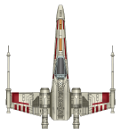 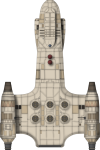 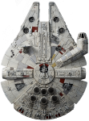

- __Le Fond__ 

  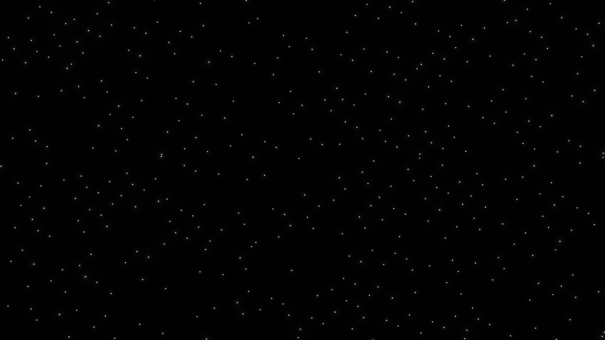

---

# Pêche Aux Vaisseaux :rocket: `2/5`

| Fonction               | Utilité                                                                                                                                         |
|------------------------|-------------------------------------------------------------------------------------------------------------------------------------------------|
| ```PAC_Create()```       | Permet d'allouer la mémoire nécessaire pour le jeu                                                                                                 |
| ```PAC_Update()``` | Permet d'actualiser les évènements clavier et souris (entrée dans le jeu, click sur un vaisseau etc)                                                                                             |
| ```PAC_TimedUpdate()```    | Permet de Mettre à jour la position des vaisseaux et gère les collisions                                               |
| ```PAC_Destroy()```        | Permet de détruire les textures des vaisseaux et des polices                                          |
|```Check_Click_on_Duck()```| Compare les coordonnées de la souris avec celles des vaisseaux si le bouton de la souris est enfoncé|
---

# Pêche Aux Vaisseaux :rocket: `3/5`

| Fonction               | Utilité                                                                                                                                         |
|------------------------|-------------------------------------------------------------------------------------------------------------------------------------------------|
| ```PAC_Coordinates_Create()```       | Permet de générer alléatoirement la valeur de la vitesse des vaisseaux et génère leurs positions selon un plan prédéfini                                                                                                 |
| ```Check_Duck_Collisions()``` | Permet de comparer les positions des vaisseaux entre eux en se servant de leurs positions  et des fonctions __al_get_bitmap_height__ et __al_get_bitmap_width__                                                                                          |
| ```Was_Key_Pressed()```    | Si un click à eu lieu, on attend un appui sur une touche générée alléatoirement                                               | 
---

# Pêche Aux Vaisseaux :rocket: `4/5`

| Structures               | Utilité                                                                                                                                         |
|------------------------|-------------------------------------------------------------------------------------------------------------------------------------------------|
| ```PAC_Gamedata```       | Stocke toute les informations du jeu (Textures / Polices / Etat des canards / Stocke les infos des canards dans une sous structure)                                                      |
| ```DuckInfos``` | Contient les informations de chaque canard (Sa postition / Sa vitesse, La touche à appuyer pour le capturer / Le nombre de point qu'il rapporte). Cette structure est intialisée avec un malloc dans __PAC_Create__ |

---

# Pêche Aux Vaisseaux :rocket: `5/5`

### Les fonctionnalités

- Rebond des Vaisseaux entre eux et avec le bord de l'écran :rocket:
- Génération aléatoire des vitesses des vaisseaux leur conférant un comportement aléatoire
- Double action pour la capture (Click + Touche du clavier) 
- La touche du clavier à presser est générée alléatoirement :keyboard:
- Des musiques sont présentes das le menu / Jeu / Tableau des scores :notes:
- Effets sonores lorsque l'on détruit un vaisseau :sound:
- Timer du temps restant à l'écran

---

# Menu  `1/2`

### Fonctionnalités ➕

- Lancer le jeu en saisissant les noms des joueurs au préalable
  - Les noms des joueurs peuvent faire jusqu'à 9 charactères et être édités
  - La sauvegarde se fait avec entrée
- Les paramètres du jeu peuvent être réglés directement dans le menu (Boutons)
  - Volume de la musique
  - Volume des effets sonores
- Accès aux crédits
- Boutons interactifs

---

# Menu  `2/2`

### Stockage des données

| Structures               | Utilité                                                                                                                                         |
|------------------------|-------------------------------------------------------------------------------------------------------------------------------------------------|
| ```Menu_Gamedata```       | Stocke les paramètre du jeu (échelle de résolution / volumes SFX et Musique). Contient également les textures du menu.                                                     |
| ```GAME``` | Les informations saisies par les joueurs tel que les noms ou les paramètres sont enregistrés dans la structure __GAME__ et la structure __pPlayer__ (contenue dans __GAME__)  |

---

# Audios  `1/3`


| Fonctions               | Utilité                                                                                                                                         |
|------------------------|-------------------------------------------------------------------------------------------------------------------------------------------------|
| ```Allegro_Play_Sample / Allegro_stop_sample```       | Permet de lire ou d'arrêter un audio                                                     |
| ```Allegro_Sample_Create()``` | Alloue et importe des audios dans la mémoire vive  |
| ```Init_Sample()``` | Permet de créer des instances correspondantes aux audios |

---

# Audios  `2/3`

| Fonctions               | Utilité                                                                                                                                         |
|------------------------|-------------------------------------------------------------------------------------------------------------------------------------------------|
| ```Set_Sample_Instance```       | Permet de définir le mode de lecture d'un audio (Lecture en Boucle / une seule fois / ainsi que le gain)                                                     |
| ```Set_New_Sample_Instance()``` | Permet de modifier les paramètres de lecture des audios lorsque l'on sort du menu  |

---

# Audios  `3/3`

| Structures               | Utilité                                                                                                                                         |
|------------------------|-------------------------------------------------------------------------------------------------------------------------------------------------|
| ```ALLEGRO_GAME_SAMPLES_INSTANCE```       | Stocke les paramètres de lecture de chaque audio                                                     |
| ```ALLEGRO_GAME_SAMPLES()``` | Stocke les fichiers audios de tous les jeux  |
|```ALLEGRO_MANAGER``` | Contient la structure __ALLEGRO_GAME_SAMPLES_INSTANCE__ et permet d'avoir accès aux audios partout dans le code|

---

# Flappy Bird 🐦 `1/2`

### Les différentes textures :

- __Les Obstacles__ :

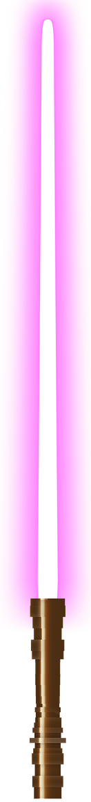


- __Le personnage__ :

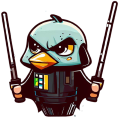


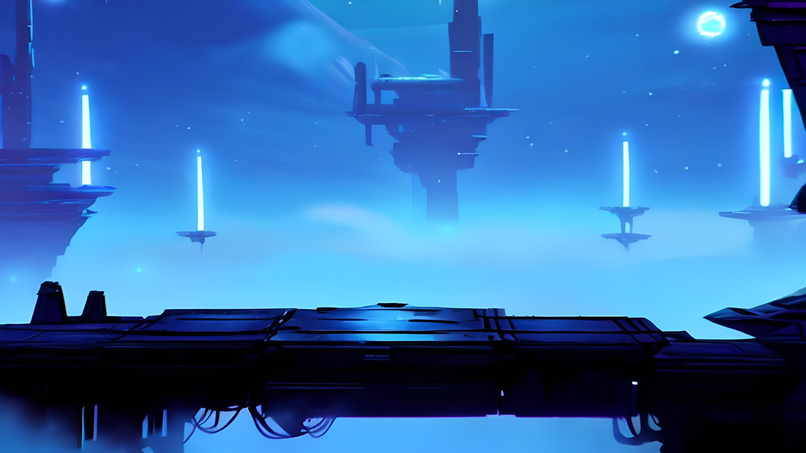

---

# Flappy Bird  🐦 `2/2`

# Les fonctionnalités ➕ :

- Les joueurs peuvent sauter pour aller le plus loin 🏃

- Des obstacles sont à éviter en passant entre les lasers 💥

- Celui qui va le plus loin gagne 🏆

- Musique d'arrière plan et effets sonores :notes:

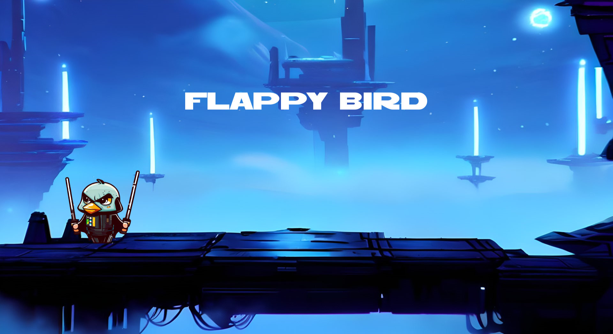


# Thibault

- `✅ 100%` __Traversée de la rivière__: __Jeux obligatoire__  (renommé "Traversée du champ de bataille" dans le style de Star Wars   🚀)


- `✅ 100%` __Geometry Dash__


- `✅ 100%` __Flappy Bird__


---


# Traversée de la rivière  :airplane:  :milky_way: `1/7`

### Les différentes textures :

- __Les Obstacles__ : (possibilité d'en rajouter)
   

- __Le personnage et l'animation de vitoire__ :

 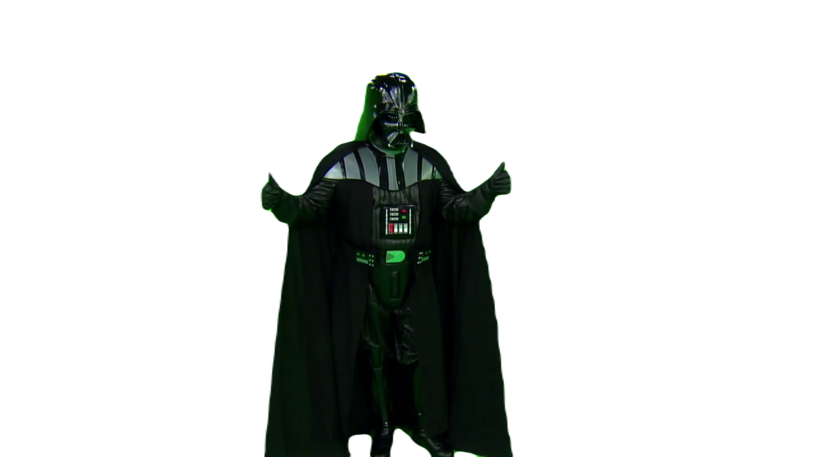

---


# Traversée de la rivière  :airplane:  :milky_way: `2/7`

### Les différentes textures :

- __Une zone de paix__ :


- __Le fond étoile__


- 2 pointeurs sont importants : GameData (qui enregistre les données) et obstacles (qui enregistre les données uniquement pour les obstacles)
---
# Traversée de la rivière  :airplane:  :milky_way: `3/7`

__Fonctionnement interne__
-Le joueur spawn sur un zone de paix et peux avancer, aller à droite et à gauche
-Les différents obstacles sont génerés alléatoirement, pouvant aller avec des directions (allterné une sur deux pour pas trop mettre de difficulter au joueur) et des vitesses alléatoires
-Le fond entraine le joueur sur le côté comme une rivière (des zones de paix permet de souffler)
-La vie et le timer sont gérés (les collisions avec des vaisseaux ou une sortie d'écran enlève de la vie)
-Les menus ponctuent le jeu avec les sons pour permettre une meilleur immertion

---
# Traversée de la rivière  :airplane:  :milky_way: `4/7`


---

# Traversée de la rivière  :airplane:  :milky_way: `5/7`

| Fonction               | Utilité                                                                                                                                         |
|------------------------|-------------------------------------------------------------------------------------------------------------------------------------------------|
| ```TDLR_Create()```       | Permet d'allouer la mémoire nécessaire pour le jeu                                                                                                 |
| ```TDLR_Update()``` | Permet d'actualiser les évènements clavier et souris (entrée dans le jeu, click sur un bouton, etc.)                                                                                             |
| ```TDLR_TimedUpdate()```    | Permet de mettre à jour la position des vaisseaux, gère les collisions, afficher les textures, ... toutes les secondes                                               |
| ```TDLR_Destroy()```        | Permet de détruire les textures des vaisseaux et des polices                                          |
|```Inverse()```| Permet de mettre les strats, les couches dans le bonne ordre d'affichage |
---

# Traversée de la rivière  :airplane:  :milky_way: `6/7`

| Fonction               | Utilité                                                                                                                                         |
|------------------------|-------------------------------------------------------------------------------------------------------------------------------------------------|
| ```generation_strat () / position_alleatoire ()```       | Permet de générer et positionner les différents éléments aléatoirement                                                                                            |
| ```affichage_strat () / affichage_fond ()``` | Permet d'afficher les différentes couches de vaisseaux et le fond en temps réel                                                                     |
| ```colision()```    | Permet de retirer de la vie si le joueur touche un vaisseau                                               |
| ```next_joueur()```        | Permet de passer d'un joueur à un autre (possibilité d'ajouté plusieurs joueurs)                         |

---

# Traversée de la rivière  :airplane:  :milky_way: `7/7`

# Les fonctionnalités ➕ :

➖ Les joueurs peuvent avancer, aller à droite ou gauche pour esquiver les vaisseaux 🏃

➖ Les vaisseaux alléatoire passe de tout les côtés 🚀

➖ Le joueur se fait entrainé par les flots d'étoile 🌊🌠

➖ Système de vie mise en place (en haut à gauche) ❤️
(sortir de l'écran ou touche un vaisseau fait prendre des dégats)

➖Des zones de paix sont présentes pour faire une pause 💤

➖ Système de timer (en haut à droite)🕜

➖Celui qui va le plus loin gagne 🏆

---


# Geometry Dash  🏃 🔺 `1/3`

### Les différentes textures :

- __Les Obstacles__ :

 


- __Le personnage__ :
  

---

# Geometry Dash  🏃 🔺 `2/3`


---

# Geometry Dash  🏃 🔺 `3/3`

# Les fonctionnalités ➕ :

➖ Les joueurs peuvent sauter pour aller le plus loin 🏃

➖Des obstacles  et le vide sont à éviter toute en passant sur les platformes pour aller le plus loin🔺

➖Celui qui va le plus loin gagne 🏆


 
 ---
# Matthieu

- `✅ 100%` __Snake__ : __Jeux obligatoire__


- `✅ 100%` __Guitare Hero__ (renommé "Dark piano" dans le style de Star Wars   🚀)


- `✅ 100%` __Flappy Bird__

- `✅ 100%` __Geometry Dash__


---

# Snake  🐍 `1/5`

## Les différentes textures `1/2`:

- __La nourriture__ : 

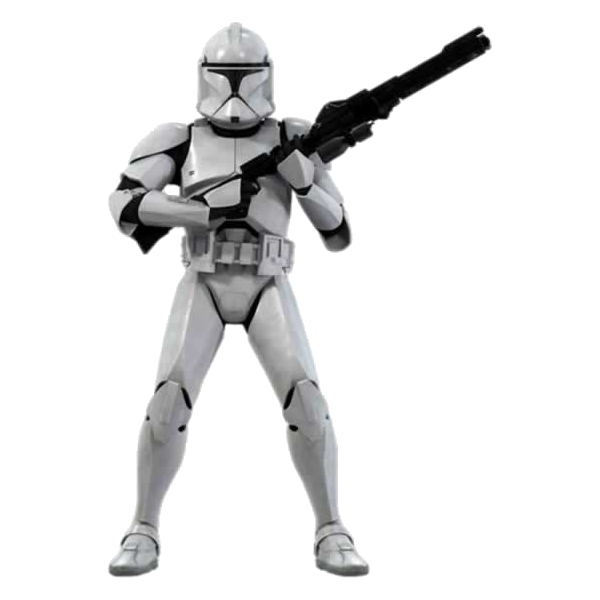

---

- __Les personnages__ :

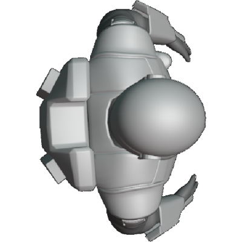

---
# Snake  🐍 `2/5`

- __Dark Vador holographique__ : 
7 images s'affichent les unes après les autres pour créer une animation.

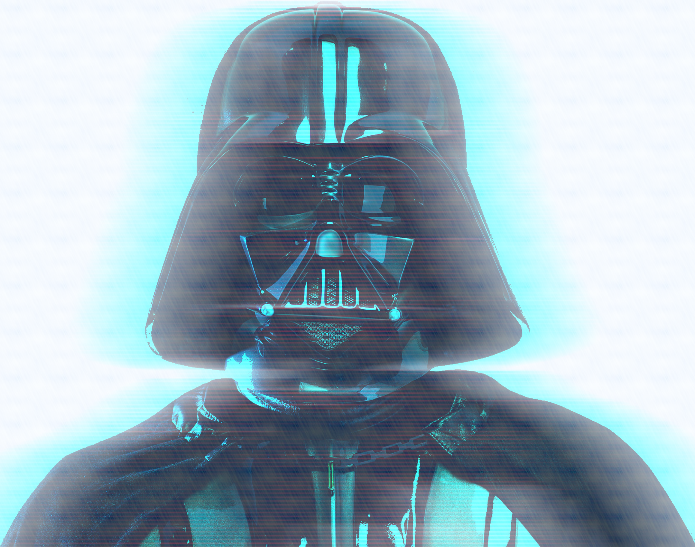

___

# Snake  🐍 `3/5`

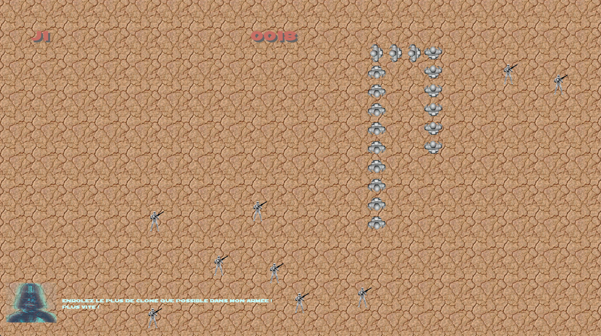

---

# Snake  🐍 `4/5`

## Conception ⚙️ :

- Le serpent est géré par une liste chaînée.
- Les fonctions liées au serpent utilises la récursivité

---

# Snake  🐍 `5/5`

## Les fonctionnalités ➕ :

➖ Le joueur doit enroler de nouveaux clones dans son armée.

➖ Le joueur ne doit pas marcher sur sa propre armée

➖ Les touches de contrôles sont les suivantes:
> Z Q S D 

➖ Celui qui crée la plus grande a gagné 🏆
 

 ---


 
# Dark piano 🎶 🎵 🎹 `1/3`

## Les différentes textures :

- Les touches visuels :

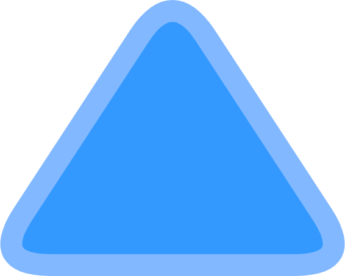 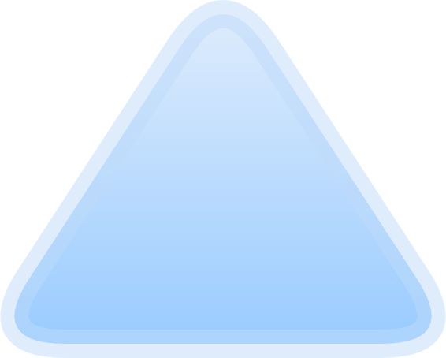 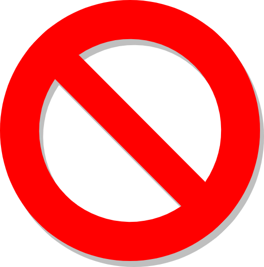

---

# Dark piano 🎶 🎵 🎹 `2/3`

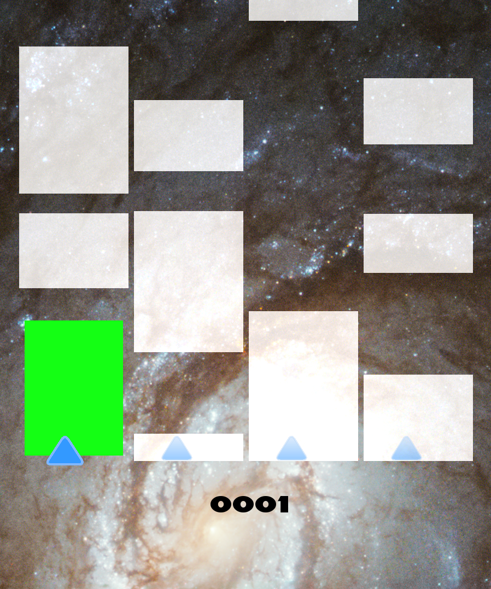

---

# Dark piano 🎶 🎵 🎹 `3/3`

# Les fonctionnalités ➕ :

➖ Les touches de contrôles sont les suivantes:
> A Z E R 

➖ Le joueur doit appuyer sur les touches au bon moment

➖ Les fautes à éviter :
* Appuyer trop tôt sur une touche
* Laisser passer une note sans appuyer dessus

➖ La partie est finie après 3 fautes